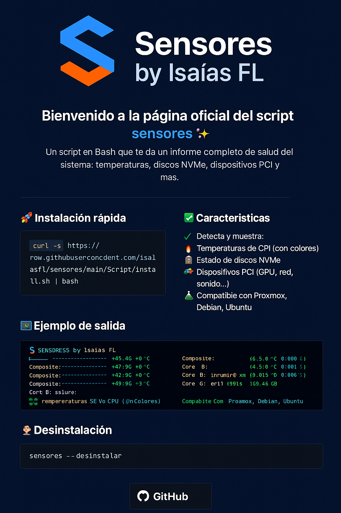

<h1 align="center">🚀 <b>Proyecto Sensores</b></h1>
<h3 align="center">📊 Monitorea tu sistema con estilo</h3>

<p align="center">
  
</p>

---

Script en Bash que genera un <strong>informe profesional</strong> con:

✅ Temperaturas de CPU  
✅ Estado de discos NVMe  
✅ Dispositivos PCI conectados  
✅ Salida clara y coloreada  
✅ Funciona en Proxmox, Debian, Ubuntu...

---

## ⚡ Instalación rápida

<a href="#instalacion">
  
</a>

```bash
curl -s https://raw.githubusercontent.com/isaiasfl/sensores/main/Script/install.sh | bash
```

